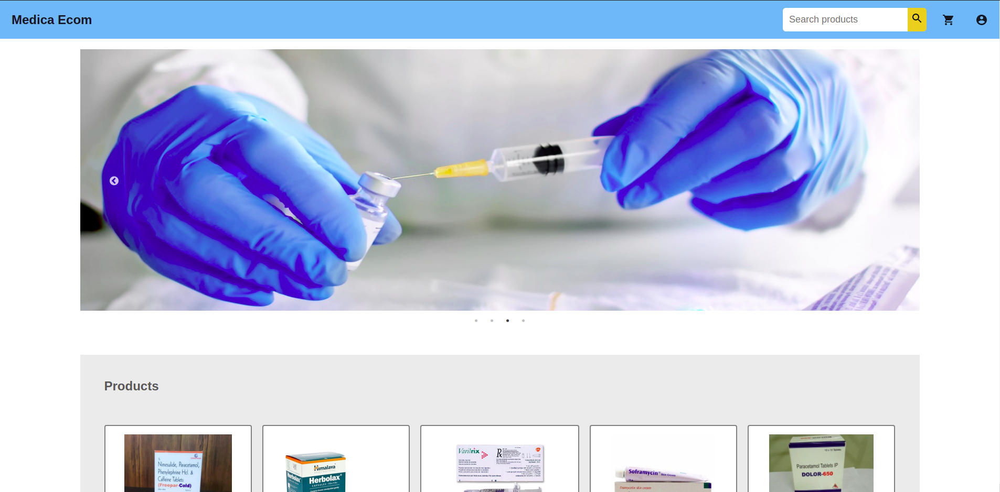
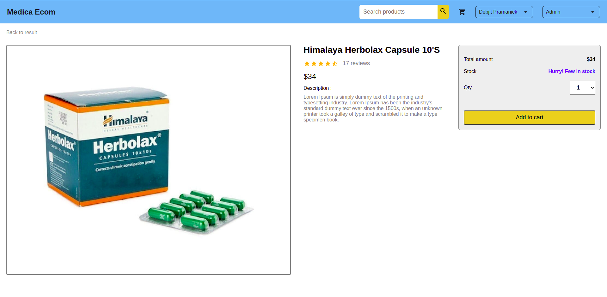
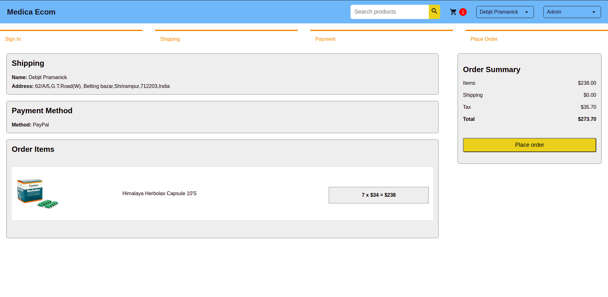
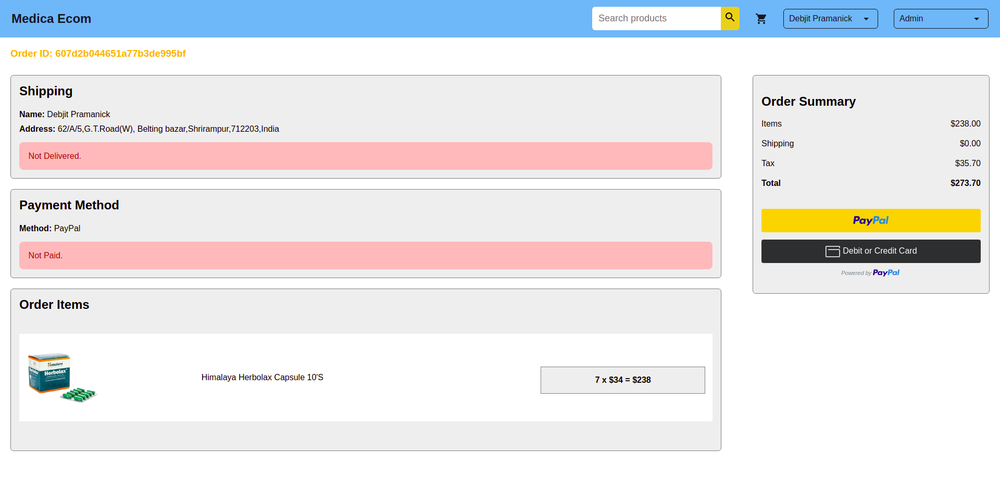
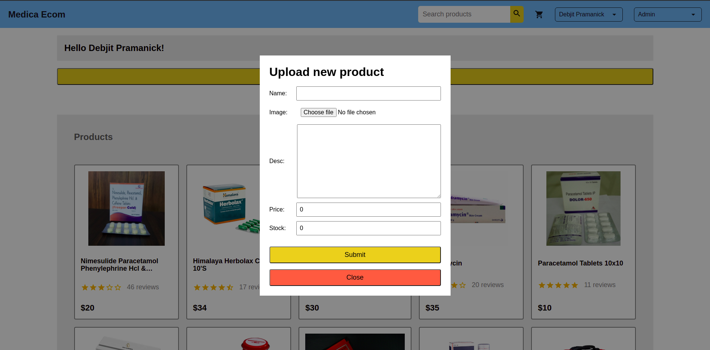

<h1 align="center">MEDICA ECOM</h1>
  <p align="center">
    A telemedicine app.
    <br />
    <a href="https://medica-ecom.netlify.app/">Go to live app</a>
  </p>
</p>


<!-- TABLE OF CONTENTS -->
<details open="open">
  <summary>Table of Contents</summary>
  <ol>
    <li>
      <a href="#about-the-project">About The Project</a>
      <ul>
        <li><a href="#built-with">Built With</a></li>
      </ul>
    </li>
    <li>
      <a href="#getting-started">Getting Started</a>
      <ul>
        <li><a href="#prerequisites">Prerequisites</a></li>
        <li><a href="#installation">Installation</a></li>
      </ul>
    </li>
    <li><a href="#usage">Usage</a></li>
    <li><a href="#roadmap">Roadmap</a></li>
</details>


<!-- ABOUT THE PROJECT -->
## About The Project


<br>

A telemedicine web app for delivering medicine at door steps.

A list of commonly used resources that we find helpful are listed in the acknowledgements.

### Built With
* React JS
* Node JS
* Express JS
* MongoDB


<!-- GETTING STARTED -->
## Getting Started

To get a local copy up and running follow these simple example steps.

### Prerequisites

This is an example of how to list things you need to use the software and how to install them.
* Node must be installed.

### Installation

1. Clone the repo
   ```
   git clone https://github.com/DebjitPramanick/Medica-Ecom.git
   ```
2. Install node modules
   ```
   npm install
   ```
3. Start client
   ```
   cd client
   npm start
   ```
4. Start server
   ```
   cd server
   nodemon server.js
   ```

   

<!-- USAGE EXAMPLES -->
## Usage

Here are some examples of how my app works.
<br>

<br>

<br>

<br>

<br>
